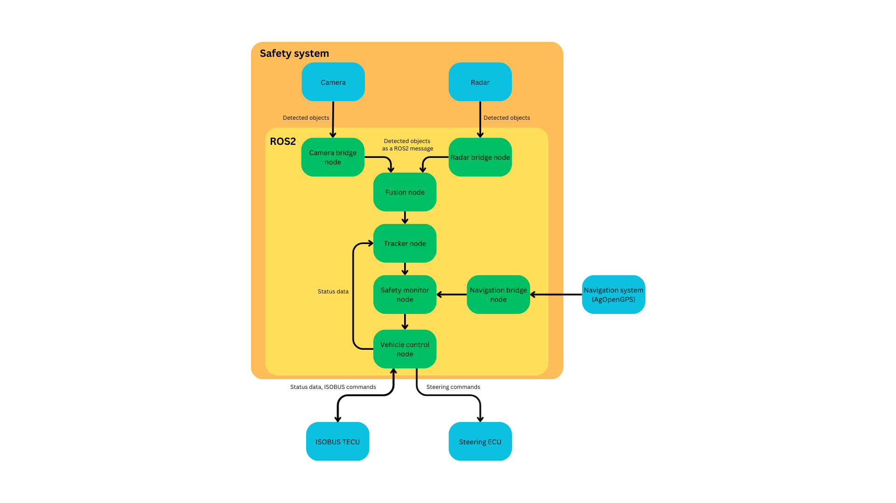
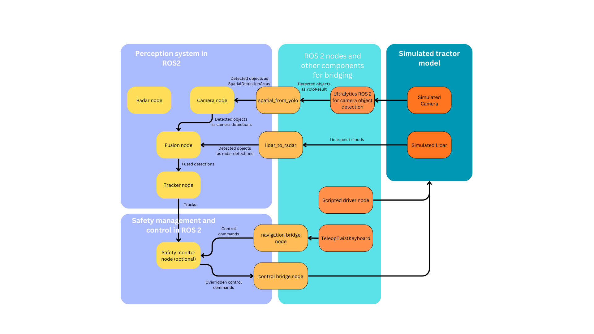

# ROS 2 Autonomous Tractor Safety System (Radar + Camera)



ROS 2 packages for a **retrofit** autonomous tractor safety system that uses **automotive radar + camera** to detect and track obstacles in front of a tractor. The system is designed as a modular perception + safety pipeline, runnable both with real sensors and in Gazebo simulation.

> **Important**  
> This is a **research prototype**, not a certified safety system.  
> **Do not** use it as-is for safety-critical operation.

This work was carried out at the **University of Oulu** as part of the **KATI** project.

---

## Repository structure

Package/directories:

- `src/camera_interface/` – interface from OAK-D camera detections to target messages
- `src/radar_interface/` – interface from Nanoradar SR75 (CAN) to target messages
- `src/sensor_fusion/` – decision-level radar–camera fusion + tracking
- `src/safety_monitor/` – simple safety logic (distance thresholds, etc.)
- `src/navigation_interface/` – navigation / path interface (mainly for sim)
- `src/tractor_control/` – interface to tractor control (real or sim)
- `src/tractor_safety_system_launch/` – launch files for the safety system
- `src/tractor_safety_system_interfaces/` – shared message definitions
- `src/simulations/` – Gazebo models, worlds, launch and logging tools
- `testing_tools/` – scripts for running test scenarios and analyzing the results

---

## Prerequisites

Core:

- ROS 2 (tested with **Jazzy**)
- Gazebo (**Harmonic** or compatible) + `ros_gz` bridge
- `colcon` + CMake toolchain

Gazebo Harmonic installation (Ubuntu):

- Follow the official guide: https://gazebosim.org/docs/harmonic/install_ubuntu/
- After installing Gazebo, install the ROS ↔ Gazebo bridge for your ROS distro (e.g., `ros-jazzy-ros-gz`).

Real sensors (optional):

- Luxonis **OAK-D S2** camera via `depthai-ros` (uses built-in neural network for object detection)
- **Nanoradar SR75** 4D radar via CAN (uses built-in object detection)

Simulation perception (required for simulation scenarios only):

- **Ultralytics YOLO** tracker node via `ultralytics_ros` (typically from a separate `~/yolo_ws` workspace and its Python venv)
    - Used only for Gazebo simulation camera processing
    - Not needed for real-world testing with OAK-D camera

Analysis (optional):

- Python 3 + `numpy`, `pandas`, `matplotlib`

---

## Build

Assuming a standard ROS 2 workspace:

```bash
mkdir -p ~/ros2_ws/src
cd ~/ros2_ws/src
git clone <this-repo-url>
cd ..
colcon build
source install/setup.bash
```

> Note: run `source install/setup.bash` in every new terminal before launching nodes.

---

## Sensor interfaces

### Camera (OAK-D S2 / depthai-ros)

The camera interface is configured for the **OAK-D S2** camera with `depthai-ros` driver. The OAK-D performs **on-device neural network inference** for object detection using its built-in VPU. In order to run the camera with this setup, depthai-ros package must be installed.

`camera_interface` typically:

- Subscribes to camera detection topics (with spatial/depth information)
- Converts detections into **3D target positions** in the tractor base frame
- Publishes a list of camera targets for fusion/tracking

The OAK-D's built-in neural network eliminates the need for external target detection when using real hardware.

### Radar (Nanoradar SR75 over CAN)

The radar interface expects SR75 track data over CAN.

`radar_interface` typically:

- Reads CAN frames from `can0`
- Decodes SR75 “track data information” messages
- Publishes radar target lists in the tractor base frame

To use a different radar, implement a compatible interface node that outputs the same target message type.

---

## Fusion + tracking overview

### Decision-level fusion

`sensor_fusion` performs decision-level fusion:

- Subscribes to targets from radar and camera
- Uses TF2 to transform detections into the **tractor base frame**
- Assigns a simple 2D covariance per detection using sensor characteristics  
  (camera: strong angle, weaker range; radar: strong range, weaker angle)

Per cycle (nominally ~20 Hz):

1. Select detections within a short time window
2. Form camera–radar candidate pairs close in time
3. Compute Mahalanobis distance using the sum of covariances
4. Gate pairs using a chi-square threshold
5. Fuse matched pairs:
   - position = covariance-weighted average
   - keep camera classification + radar speed
6. Pass through unmatched detections (with filtering so fused detections take priority)

Output: filtered list of fused + single-sensor detections in the tractor frame.

### Tracking with ego-motion compensation

Tracking is a linear Kalman filter with a constant-velocity model.

State (ground plane):

- `[x, y, vx, vy]`

Key points:

- Constant-velocity motion model with white-acceleration process noise (tunable)
- Ego-motion compensation using odometry/twist (speed + yaw rate)
- Maintains an approximate tractor pose in a world frame:
  - detections → world frame for updates
  - tracks → converted back to tractor base frame for output

This helps static targets remain approximately static in the body frame even when the tractor follows curved paths.

Data association + track management:

- Chi-square gating + greedy nearest-neighbour association
- New tracks from unmatched detections
- Track confirmation after a minimum number of hits
- Track deletion after too many consecutive misses

Published tracks (confirmed only) typically include:

- position, speed, distance
- unique track ID

---

## Simulation tools

`src/simulations/` contains Gazebo models, worlds, interfaces for testing and simulation, and launch/logging tools:

```text
src/simulations/
├── config          # scenario & logging configuration
├── launch          # launch files (Gazebo + ROS 2)
├── models          # models for tractor and pedestrian actors
├── simulations     # Gazebo helpers, integration test helpers, and logging tools
└── worlds          # Gazebo world files (S1–S4)
```

Scenarios used in associated research:

- **S1** – single static pedestrian ahead of the tractor
- **S2** – multiple static pedestrians at different positions
- **S3** – two pedestrians crossing in front of a stationary tractor
- **S4** – tractor approaching static pedestrians along an S-shaped path

Simulation tools overview (example):



### Run all scenarios

A helper script can launch all scenarios and log data:

```bash
cd ~/ros2_ws/src/<this-repo>
bash testing_tools/run_all_simulation_scenarios.sh
```

This script is intended to:

- Start the appropriate Gazebo world
- Launch interfaces, fusion/tracking, and logging nodes
- Run each scenario and generate CSV logs

Check the script for topic names and output paths and adjust as needed.

---

## Analysis tools

`testing_tools/analysis_tools/` contains Python scripts to evaluate detection and tracking performance from CSV logs.

Inputs per scenario:

- raw radar/camera detections
- fused detections
- confirmed tracks
- ego odometry (pose/yaw over time)

Analysis steps:

- transform static pedestrian ground-truth positions into tractor frame using ego odometry
- associate detections/tracks to pedestrians within a distance threshold
- compute metrics such as:
  - detection recall
  - position RMSE and empirical error radii (e.g., 95% radius)
  - false detection rate
  - track availability and ID stability
  - residual track speeds for static pedestrians
- plot detections/tracks/ground truth in the tractor body frame

Example usage:

```bash
cd testing_tools/analysis_tools

python3 analyze_scenario.py   --scenario S1   --raw path/to/raw_detections.csv   --fused path/to/fused_detections.csv   --tracks path/to/tracks.csv   --ego path/to/ego_odometry.csv   --out_prefix plots/S1
```

---

## Using other sensors

Fusion + tracking are sensor-agnostic as long as:

- sensors provide target-level detections (positions and optional covariances) in a known TF frame
- message types and frame conventions match what `sensor_fusion` expects

To support other sensors:

- replace/adapt `camera_interface` and/or `radar_interface`
- keep target messages and TF frames consistent
- retune noise parameters and gating thresholds as needed

---

## Disclaimer

This repository is intended for research and development. It is **not** a certified safety system. Using it on real machinery requires additional engineering, validation, and compliance with local safety regulations.

## Quick command reference (ROS 2 / CAN / Simulation)

The following snippets are a practical "cheat sheet" for running the radar, CAN interface, and Gazebo simulation on a typical development machine.

> Notes:
> - Replace `WORKSPACE` with your ROS 2 workspace path (e.g. `~/ros2_ws`).
> - The YOLO stack (for **simulation only**) is assumed to live in `~/yolo_ws` (adjust if different).
> - For **real-world testing**, the OAK-D camera has built-in neural network processing (no YOLO needed).
> - You typically need **two terminals** when running Gazebo simulation (one for simulation, one for YOLO).

### Radar over CAN (Kvaser USB-CAN)

There are two options to bring up the CAN interface for the Nanoradar SR75.

Option A (recommended): use the helper script:

```bash
cd testing_tools
./setup_can.sh can0 1000000

# verify incoming frames
candump can0
```

Option B: manual bring-up:

```bash
sudo modprobe kvaser_usb
sudo ip link set can0 down 2>/dev/null || true
sudo ip link set can0 type can bitrate 1000000
sudo ip link set can0 up

# verify incoming frames
candump can0
```

### Virtual CAN (vcan0) for simulated CAN traffic

Follow the SocketCAN approach described in the python-can docs (SocketCAN):  
https://python-can.readthedocs.io/en/stable/interfaces/socketcan.html

```bash
sudo modprobe can
sudo ip link add dev vcan0 type vcan
sudo ip link set vcan0 up
```

### Simulation: teleop keyboard
Can be used to control tractor in simulation. Bridge nodes for control commands must also be used.

```bash
ros2 run teleop_twist_keyboard teleop_twist_keyboard
```

### Simulation: bridges / bring-up

```bash
# Source both workspaces so the sim can subscribe to ultralytics_ros messages
# (order doesn't matter; source your main workspace last if you want it to take precedence)
source ~/yolo_ws/install/setup.bash
source install/setup.bash

# Basic Gazebo bring-up (useful for debugging). This does not start YOLO; run the
# ultralytics_ros tracker in a separate terminal.
ros2 launch simulations bring_up_sim.launch.py
```

### Safety system core components

```bash
# Most important launch args (common):
#   params:=/abs/path/to/parameters.yaml
#   can_channel:=can0|vcan0
#   start_camera_driver:=true|false
#   start_camera/start_radar/start_tracker/start_safety_monitor/start_control:=true|false
#   publish_tf:=true|false
#   camera_tf_x/y/z/roll/pitch/yaw:=...   (base_link -> camera_link)
#   radar_tf_x/y/z/roll/pitch/yaw:=...    (base_link -> radar_link)

# Recommended: full system (perception + safety monitor + control)
ros2 launch tractor_safety_system_launch safety_system_core.launch.py \
  start_camera_driver:=true \
  can_channel:=can0 \
  camera_tf_x:=0.5 camera_tf_y:=0.0 camera_tf_z:=0.9 \
  camera_tf_roll:=-1.5708 camera_tf_pitch:=0.0 camera_tf_yaw:=-1.5708 \
  radar_tf_x:=0.6 radar_tf_y:=0.0 radar_tf_z:=0.6 \
  radar_tf_roll:=0.0 radar_tf_pitch:=0.0 radar_tf_yaw:=0.0

# Example: swap to a custom parameters file
# ros2 launch tractor_safety_system_launch safety_system_core.launch.py \
#   params:=/abs/path/to/parameters.yaml

# Example: disable subsystems (debugging)
# ros2 launch tractor_safety_system_launch safety_system_core.launch.py \
#   start_control:=false start_safety_monitor:=false

# Alternative: Launch perception stack only (sensor interfaces + fusion + tracking)
ros2 launch tractor_safety_system_launch perception_stack.launch.py \
  start_camera_driver:=true \
  can_channel:=can0 \
  camera_tf_x:=0.5 camera_tf_y:=0.0 camera_tf_z:=0.9 \
  camera_tf_roll:=-1.5708 camera_tf_pitch:=0.0 camera_tf_yaw:=-1.5708 \
  radar_tf_x:=0.6 radar_tf_y:=0.0 radar_tf_z:=0.6

# Alternative: Launch safety stack only (fusion + safety monitor + control)
ros2 launch tractor_safety_system_launch safety_stack.launch.py \
  start_tracker:=true start_safety_monitor:=true start_control:=true

```

### YOLOv8 object detection (ultralytics-ros) - Simulation Only

> **Note:** This is only required for **Gazebo simulation scenarios**. Real-world testing uses the OAK-D camera's built-in neural network.

This repo’s simulation pipeline expects the ROS 2 package `ultralytics_ros` to be available (it provides the custom message `ultralytics_ros/msg/YoloResult` and the `tracker.launch.xml` launch file).

#### Build `ultralytics_ros` in a separate workspace

Keeping YOLO in its own workspace avoids pulling large Python dependencies (Ultralytics / PyTorch / OpenCV) into your main safety-system workspace.

As of **Ubuntu 24.04 (noble) + ROS 2 Jazzy**, there is typically **no apt binary** for `ultralytics_ros`, so install from source.

1) Create a workspace and clone `ultralytics_ros`:

```bash
mkdir -p ~/yolo_ws/src
cd ~/yolo_ws/src

# ROS 2 branch (works well for Humble; builds on Jazzy if header file includes are updated to .hpp (instead of .h))
GIT_LFS_SKIP_SMUDGE=1 git clone -b humble-devel https://github.com/Alpaca-zip/ultralytics_ros.git
```

2) Install ROS dependencies and build:

```bash
cd ~/yolo_ws
source /opt/ros/jazzy/setup.bash
rosdep update
rosdep install -r -y -i --from-paths src
colcon build --symlink-install
```

3) Install Python dependencies for the tracker node:

```bash
python3 -m venv --system-site-packages ~/yolo_ws/.venv
source ~/yolo_ws/.venv/bin/activate
python3 -m pip install -U pip

# Install Ultralytics (and its Python dependencies).
# If you run into OpenCV / CUDA / torch issues, follow the upstream ultralytics_ros README.
python3 -m pip install -U setuptools wheel
python3 -m pip install ultralytics
```

4) Verify the message type is visible:

```bash
source ~/yolo_ws/install/setup.bash
ros2 interface show ultralytics_ros/msg/YoloResult
```

#### Run the YOLO tracker (Terminal 1)

Typical command (exact launch file may differ depending on the upstream repo/version):

```bash
source /opt/ros/jazzy/setup.bash
source ~/yolo_ws/install/setup.bash

# If you created a venv for Python deps
source ~/yolo_ws/.venv/bin/activate

ros2 launch ultralytics_ros tracker.launch.xml
```

> Licensing note: the upstream `Alpaca-zip/ultralytics_ros` repository is AGPL-licensed. Keeping it in a separate workspace is usually preferable to vendoring it into this repo.

### Run Gazebo manually (optional)

If you launch scenarios via `ros2 launch simulations ...`, you should *not* need to set `GZ_SIM_RESOURCE_PATH` manually.

If you want to run Gazebo directly, point `GZ_SIM_RESOURCE_PATH` at the *installed* models directory:

```bash
source install/setup.bash

SIM_SHARE="$(ros2 pkg prefix simulations)/share/simulations"
export GZ_SIM_RESOURCE_PATH="${GZ_SIM_RESOURCE_PATH:-}:$SIM_SHARE/models"

gz sim "$SIM_SHARE/worlds/simple_field.sdf"
```

### Run one scenario (S1–S4)

Prerequisite: start the **Ultralytics YOLO tracker** (`ultralytics_ros`) in **another terminal** using the **same ROS 2 domain / environment**, so the simulation publishes camera images and the ultralytics tracker publishes detections (e.g. `/yolo/result`).

```bash
cd WORKSPACE

# Source both so the sim can import/deserialize ultralytics_ros messages
source ~/yolo_ws/install/setup.bash
source install/setup.bash

ros2 launch simulations run_experiment_sim.launch.py scenario:=SCENARIO
```

Where:
- `SCENARIO` = `S1`, `S2`, `S3`, or `S4`

### Run all scenarios (S1–S4)

Prerequisite: start the **Ultralytics YOLO tracker** (`ultralytics_ros`) in **another terminal** using the **same ROS 2 domain / environment**, so the simulation publishes camera images and the tracker publishes detections (e.g. `/yolo/result`).

```bash
cd WORKSPACE

# Source both so the sim can import/deserialize ultralytics_ros messages
source ~/yolo_ws/install/setup.bash
source install/setup.bash

bash testing_tools/run_all_simulation_scenarios.sh
```

## See also (real-world)

- [testing_tools/REAL_WORLD_TESTING_GUIDE.md](testing_tools/REAL_WORLD_TESTING_GUIDE.md): step-by-step field workflow (bring-up, test procedure, and what to verify).
- [testing_tools/CALIBRATION.md](testing_tools/CALIBRATION.md): how to collect calibration data and generate TF values to use in launches.