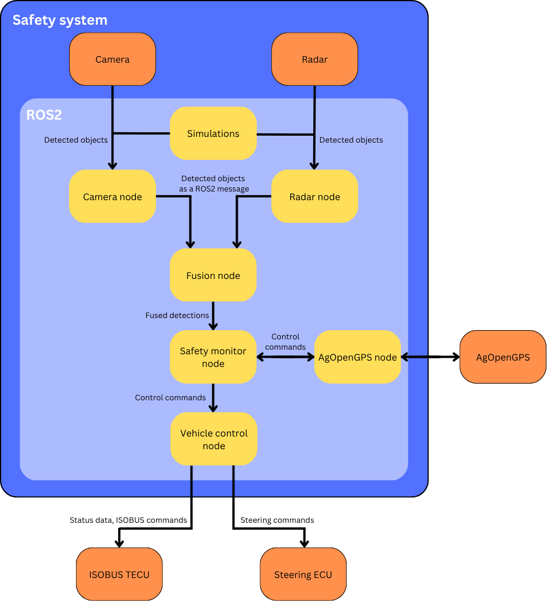

# ROS2 project for an autonomous tractor safety system

This repository contains a ROS2 project for an autonomous tractor safety system, which relies on radar and camera sensors for object detection. The aim of this project was to create a "Version 0" grade system, which can be improved and developed in the future. Versions 0, 1 and 2 are explained below.

This project is done as part of a Master's Thesis work in the University of Oulu.

Component       | Version 0     | Version 1     | Version 2     |
----------------|------------------------------|-------------------------------|--------------------------|
Camera Node     | Full functionality | Full functionality | Full functionality
Radar Node      | Full functionality | Full functionality | Full functionality
Fusion Node     | Perform simple fusion based on detection timestamp and positions. Publish detections from single sensors if not associated with any other sensor detection, and the detection is inside trusted detection limits. | Tracking of the targets added, publish detections from single sensors only if the target is tracked for more than one frame. Simple target recognition using the camera machine vision system. | Utilize filtering to identify false detections more accurately (for example Kalman filtering). Improved object recognition algorithm using radar point-cloud data to verify detections.
Safety Monitor  | Adjust the tractor speed state, if obstacles are detected in the vision systems sight. | Adjust tractor speed when obstacles are detected in a determined distance from the tractors path, considering also the tractor steering angle and path. | Adjust tractor path if needed according to detected objects.
Tractor Control | Receives ControlCommands, but doesn't forward them. | Able to control tractor speed through ISOBUS, but steering angle comes straight from AgOpenGPS. | Able to fully control the tractor based on AgOpenGPS and the safety system through ISOBUS.
AgOpenGPS Node  | Only simulated | Translates AgOpenGPS commands to ROS2 messages, and forwads them to the safety monitor node. | Communicates with AgOpenGPS, being able to adjust the map and assist in the path planning process.
Simulation and testing | Simple tests to the safety system without integrating to the tractor | Tested in real working environments, integrated into the tractor. | Tested in real working environments, integrated into the tractor.
All components included | Provides simulated functional safety with speed adjustment. | Provides functional safety with real tractor speed adjustment through ISOBUS. | Machine vision system assists in the control and path planning process providing details of the surroundings, such as obstacles in the real world. The path of the vehicle will be adjusted according to this updated map. Full tractor control through ISOBUS.


**Note** The safety system uses Nanoradar SR75 4D-radar and OAK-D 2 camera sensors for perception, which are interfaced through the camera_node and radar_node. These sensors can be replaced, but the interfacing nodes must be modified or replaced too. To use the OAK-D 2 camera, depthai-ros driver is used (https://github.com/luxonis/depthai-ros/tree/humble). The camera interface is configured to match running the camera with yoloV4_publisher.launch.py. Camera launch command:
```console
ros2 launch depthai_examples yolov4_publisher.launch.py camera_model:=OAK-D spatial_camera:=true
```

The radar interface is configured to match 

## System architecture:



### Camera node
- Connects to the camera using depth-ai
- Currently based on Luxonis OAK-d s2 message format
- Camera data is transformed into *CameraDetection*s
    - Messages include:
        - Header
            - Timestamp
            - Target_ID
        - Results
            - A list of hypotheses for the object
            - Hypotheses are of ROS type ObjectHypothesis
            - Includes:
                - Class_id: A unique ID of the object class.
                - Score: The confidence value of the detected object in range 0-1
                - Not used in Version 0 but will be used in Version 1.
        - Position
            - X, y and z in meters
        - Is_tracking
            - Boolean value for determining if the object is being tracked or not.
            - Not used in Version 0, but will be used in Version 1.
        - Tracking_id
            - A unique id for a tracked object.
            - Not used in Version 0, but will be used in Version 1.
        - Bbox
            - A bounding box surrounding the object.
            - Of type BoundingBox2D
            - Not used in Version 0, but can be utilized later
- Subscribes to topic “/color/yolov4_Spatial_detections”
    - This is the topic where oak-d s2 will publish its detections
- Publishes camera data into ROS topic “/camera_detections”
### Radar node
- Receives radar detections through CAN, utilizing SocketCAN
- Radar data is transformed into RadarDetection type ROS-messages
    - Messages include:
        - Position
            - x, y and z in meters
        - Speed
            - Not used in Version 0, but can be utilized later
        - Header
            - Timestamp
            - Target_ID
        - Distance
            - Calculated from the position points, based on basic trigonometry
- Publishes radar data into ROS topic “/radar_detections”
### Fusion node
- Subscribes to topics “/camera_detections” and “/radar_detections”
- Performs sensor fusion for camera and radar
- Publishes the processed detections into ROS topic “/fused_detections”
### AgOpenGPS node
- Communication from AgOpenGPS to ROS2
- Translates the AgOpenGPS messages to ROS messages
- Publishes in the ROS topic “/control/agopen”
- Not implemented in Version 0
### Tractor control node
- Subscribes to the ROS topic “/control”
- Sends control signals to the tractor through CAN (ISOBUS)
    - Not implemented in Version 0
### Safety monitor node
- Includes a state machine for controlling tractor speed
    - States:
        - “agopen”
            - No detections have been seen for detection_active_reset_time
            - Forwards agopen control commands directly
        - “moderate”
            - Is entered when a detection is inside safety_distance_1, but not closer
            - Tractor speed is overridden to speed_override_1
            - Transition to state “agopen”, if nothing is detected in detection_active_reset_time
        - “slow”
            - Is entered when a detection is inside safety_distance_2, but not closer
            - Tractor speed is overridden to speed_override_2
            - Transition to state “moderate”, if nothing is detected in detection_active_reset_time
        - “stopped”
            - Is entered when a detection is inside stopping_distance or the tractor is in a unknown state
            - Tractor is stopped
            - Transition to state “slow”, if nothing detected in vehicle_stopped_reset_time
- Subscribes to ROS topics “/control/agopen” and “/fused_detections”
- Publishes control commands into ROS topic “/control”

*Safety monitor state machine:*


### Simulation
- Includes nodes and for simulating the hardware components
- Simulations:
    - Target_to_fuse
        - Creates a node publishing matching detections to /camera_detections and /radar_detections simultaneously
        - Used for testing the fusion algorithm
    - Object_simulator
        - Creates random coordinates simulating objects
    - Radar_simulator
        - Simulates the SR75 4D radar sensor
        - Retreives the object coordinates from object_simulator
        - Creates other neccessary data for a radar detection
        - Sends the simulated detection through socket-can
    - Camera_simulator
        - Simulates the OAK-D Lite Camera sensor
        - Retreives the object coordinates from object_simulator
        - Creates other neccessary data for a camera detection
        - Publishes the simulated detection into /oakd/detections

## Testing

The packages include both unit- and integration tests for verifying the safety system. The tests are included in a ci-pipeline and will be ran in every push to the branch "main". The tests are described below.

**Integration test:**
-	Launch the following nodes:
    - Radar_node
    - Camera_node
    - Fusion_node
    - Safety_monitor_node
    - Object_simulator
    - Radar_simulator
    - Camera_simulator
    - Agopen_simulator
-	Tested features:
    - Test if the detections pass through the whole system pipeline and finally a control command is sent based on the detection

**Unit tests for independent nodes:**

- test_camera_node:
    - Test the radar data extraction from CAN
    - Test if a RadarDetection is formed correctly and published in /radar_detections

- test_radar_node:
    - Test if the camera node can receive messages from /oakd/detections
    - Test if the node correctly processes received detections and publishes them to /camera_detections as CameraDetections

- Fusion node tests:
    - test_fusion:
        - Test the fusion algorithm with corresponding detections from camera and radar
        - Test if fused detections are published correctly
    - test_single_sensor_detection:
        - Test the processing of individual detections from camera and radar
        - Test if detections are published correctly
    - test_fusion_parameters:
        - Test that parameters can be updated
    - test_detection_limits:
        - Test functionality with camera detections too far and radar detections too close
            - Should not publish

- Safety_monitor tests:
    - test_state_transitions:
        - Agopen
            - -> moderate, when detection inside safety_distance_1
            - -> slow, when detection inside safety_distance_2
            - -> stopped, when detection inside stop_distance
        - Moderate 
            - -> slow, when detection inside safety_distance_2
            - -> stopped, when detection inside stop_distance
            - -> No change, when detection is inside safety_distance_1, or outside the safety distances
            - -> agopen, if no detections in active_detection_reset_time
        - Slow
            - -> stopped, when detection inside stop_distance
            - No change, when detection inside outside of stop_distance
            - -> moderate, if no detections in active_detection_reset_time
        - Stopped
            - -> slow, if no detections in vehicle_stopped_reset_time
            - No change from detections
        - Test with unknown state
            - Should stop
    - test_safety_monitor_parameters:
        - Test that parameters can be updated
    - test_speed_control:
        - Agopen speed is overridden to speed_override_1, when in state moderate
        - Agopen speed is overridden to speed_override_2, when in state slow
        - No control commands are sent from agopen, when in state stopped
        - A stop command is sent, when in unknown state
